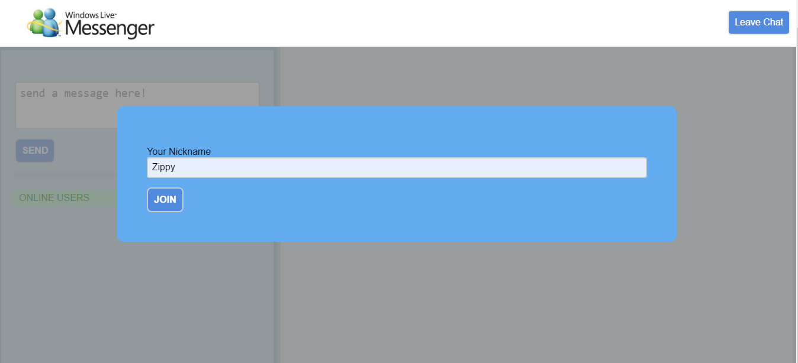
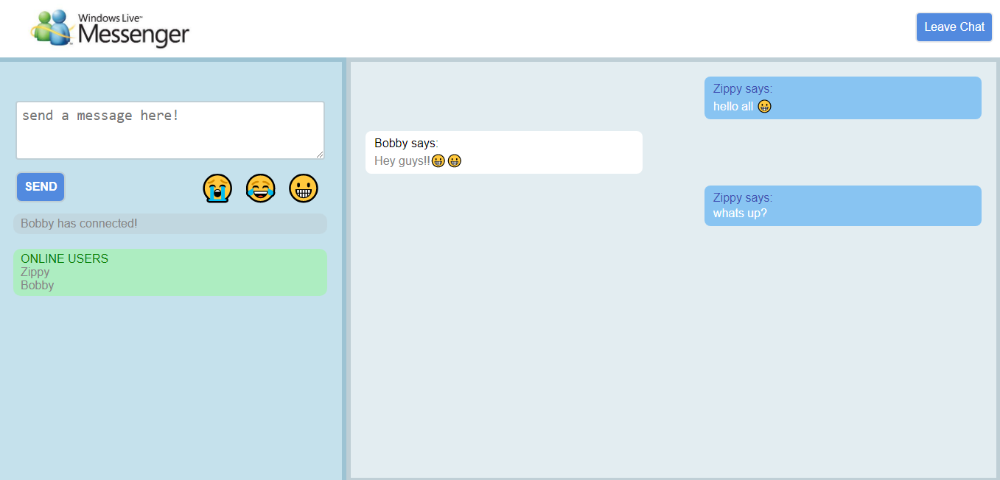

# Unger_H_ChatApp

This is a live chatting application that allows users to create a nickname and join the chat room, there are animations when messages are sent/recieved as well as an alert sound. the user can see online users and who is joining/leaving.

## Getting Started

These instructions will get you a copy of the project up and running on your local machine for development and testing purposes. See deployment for notes on how to deploy the project on a live system.

'npm install' to download required plugins
'npm run watch' to watch sass and save as compressed css
'npm run start' to get it running locally on port 3000 

### What it looks like...
what the user first sees, nickname has to be submitted and cannot be blank

what the chatting looks like, to leave must click on 'leave chat'

### Prerequisites

What things you need to install the software and how to install them

any type editor can be used, browsers such as chrome/firefox are compatible

## Deployment

the master branch is linked to heroku which is currently live at https://msnlivechatapp.herokuapp.com/

## Built With

* [node.js](https://nodejs.org/en/docs/) - javascript runtime
* [socket.io](https://socket.io/) - realtime engine
* [vue.js](https://vuejs.org/) - javascript framework
* [sass](https://sass-lang.com/documentation/file.SASS_REFERENCE.html) - style manager

## Authors

* **Helen Unger** - *design and additional modifications*

## Acknowledgments

*thanks trevor for the base of the app
